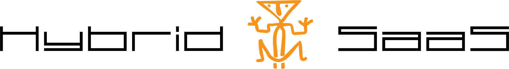

# Wat is Hybrid SaaS? #
Hybrid SaaS is de online business software voor elke branche. De gebruiksvriendelijke bedrijfssoftware biedt onder andere online oplossingen op het gebied van relatiebeheer (CRM), projectbeheer, tijdregistratie, verkoopfacturatie, inkoopfacturatie en HR management (HRM). Hybrid SaaS is ontstaan vanuit de praktijk en is gebaseerd op onze jarenlange ervaring in ondernemen: wij weten dat u niet alle tijd aan uw administratie en boekhouding wilt besteden. Hybrid SaaS werkt vanuit de gedachte “het moet simpeler en sneller kunnen”.

# Hoe werkt het? #
Onze applicatie wordt als een online dienst aangeboden volgens het SaaS-principe (Software as a Service). [SaaS](http://nl.wikipedia.org/wiki/Software_as_a_Service "SaaS") staat voor ‘Software as a Service’ en is inmiddels een breed toegepaste vorm van het aanbieden van applicaties als een online dienst. De software-applicatie en de bijbehorende database met gegevens staan op een externe server. Via het internet heeft u toegang tot Hybrid SaaS. Daarnaast betekent het dat u alleen betaalt voor het deel dat u gebruikt. Daarom kunnen wij Hybrid SaaS aanbieden tegen een betaalbare prijs. Dat scheelt aanzienlijke in de kosten voor de aanschaf en het onderhoud ten opzichte van traditionele software. 

# Het “Hybrid” van Hybrid SaaS #
Het unieke van Hybrid SaaS is het hybride gedeelte van onze online software. Doordat Hybrid SaaS gebruik maakt van een browser, die u lokaal installeert, is het werken met Hybrid SaaS te vergelijken met een applicatie die op uw computer is geïnstalleerd. De Hybrid SaaS software staat echter online. Wij zorgen ervoor dat u altijd werkt met de meest recente versie en dus hoeft u zelf niets te updaten, u heeft geen omkijken naar het beheer, onderhoud en de back-ups. Geen gedoe dus.

# Wat zijn de kosten? #
Het gebruik van Hybrid SaaS is op abonnementsbasis. Het bedrag per maand wordt bepaald aan de hand van het aantal gebruikers en de afgenomen productmodules door deze gebruikers. Een berekening van uw maandbedrag vindt u op [http://www.hybridsaas.com/calculator](http://www.hybridsaas.com/calculator "http://www.hybridsaas.com/calculator"). Wij hebben vertrouwen in onze software en daarom zijn onze standaard overeenkomsten per maand opzegbaar.

# Een abonnement aanschaffen? #
U kiest voor de modules die u wilt gaan gebruiken en geeft het aantal gebruikers in. Zo stelt u uw eigen abonnement samen, met het daarbij behorende totaalbedrag per maand. 
Graag willen wij u zo snel mogelijk op weg helpen met de processen die u met Hybrid SaaS gaat optimaliseren. Daarom helpen wij persoonlijk bij implementeren en trainen van de software op locatie. Zo heeft u zo snel mogelijk profijt van de tijdbesparing en de bijkomende kosten besparing, die onze software u gaat opleveren.

# Wij geven u graag advies #
U bent er nog niet uit? Door onze ruime ervaring en kennis, die wij hebben opgedaan binnen de diverse branches in onze relatiekring, kunnen wij u gericht adviseren. Wij helpen u daarom graag bij het maken van de juiste keuze. U kunt ons natuurlijk altijd contact opnemen voor vragen naar aanleiding van deze informatie.