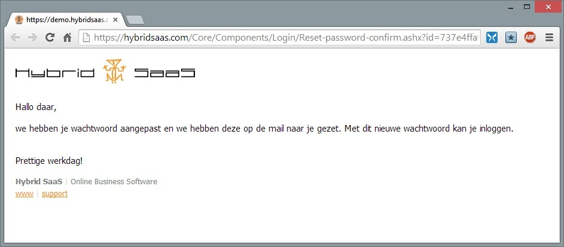

<properties menutitle="Wachtwoord vergeten" pagetitle="Wachtwoord vergeten" description="Uitleg over hoe je wachtwoord te herstellen als je deze niet meer weet." />

Wachtwoord vergeten
===================

Het kan natuurlijk altijd voorkomen dat je je wachtwoord of je inlognaam bent vergeten en daardoor niet meer kunt inloggen in je Hybrid SaaS omgeving. Je kunt zelf met je e-mailadres een nieuw wachtwoord aanvragen. Met deze procedure kan je ook je inlognaam achterhalen.

Hybrid SaaS medewerkers voeren uit veiligheidsoverwegingen geen wachtwoord reset acties uit.

Wachtwoord herstellen procedure starten
--------------------------------------- 
Om deze procedure te starten klik je op de link **"wachtwoord vergeten?"** op het inlogscherm van je Hybrid SaaS omgeving.   

Na het aanklikken van deze link krijg je de mogelijkheid te zien om je e-mailadres in te geven. Voer hier je e-mail adres in en klik op versturen. 

Nadat je je e-mail adres hebt verstuurt, geeft Hybrid SaaS je een bevestiging. 

Binnen enkele momenten ontvang je een e-mail van Hybrid SaaS.

De ontvangst van deze e-mail kan enkele minuten duren.

Ontvangst van de e-mail
--------------------------

In de zojuist ontvangen e-mail vind je de link om de wachtwoord reset uit te voeren. Klik op deze link om het wachtwoordherstel uit te voeren.
Je internetbrowser opent met daarin een bevestiging van de aanvraag van het wachtwoordherstel. Je kunt dit venster of tab afsluiten.

 
Binnen enkele momenten ontvang je wederom een nieuwe e-mail met daarin je nieuwe (tijdelijke) wachtwoord. 

Indien je meerdere Hybrid SaaS accounts hebt ontvang je voor elk account een aparte e-mail. In het onderwerp van deze e-mails kan je de inlognaam vinden.

Opnieuw inloggen met je nieuwe (tijdelijke) wachtwoord
-------------------------------------------------------
Ga terug naar de *Hybrid SaaS browser* en klik indien nodig op de **inloggen** knop om weer terug te komen bij het inlogscherm. Je kan nu inloggen met je inlognaam en het nieuwe wachtwoord.

De ingave van het wachtwoord is hoofdlettergevoelig. 

Het makkelijkste is om het wachtwoord middels kopiëren / plakken ( <strong>Control-C</strong> / <strong>Control-V</strong> ) in te voeren.

Wachtwoord wijzigen
-------------------
Nadat je bent ingelogd moet je een nieuw wachtwoord verzinnen. Geef het tijdelijke wachtwoord in en voer 2 keer je nieuwe wachtwoord in.

Je nieuwe wachtwoord moet uit minimaal 5 karakters bestaan

Het is essentieel om een veilig wachtwoord te kiezen voor je Hybrid SaaS-account. Hackers gebruiken lijsten met veelgebruikte wachtwoorden om toegang tot accounts te krijgen (niet alleen bij Hybrid SaaS, maar ook bij andere sites en applicaties). Het is dus van groot belang dat je een sterk, uniek wachtwoord gebruikt.

* Gebruik een combinatie van letters, cijfers en tekens (bijvoorbeeld de tekens die je op veel toetsenborden boven de cijfers vindt, zoals %, $, £ en !).
* Gebruik geen namen, aangezien deze snel te achterhalen zijn.
* Een langer wachtwoord is meestal sterker, maar ook moeilijker te onthouden.
* Kies een wachtwoord dat je kunt onthouden, zodat je deze niet hoeft op te schrijven.
* Kies voor elke applicatie en website waar je gebruik van maakt een uniek wachtwoord, zodat problemen met de beveiliging op andere sites geen gevolgen hebben voor de veiligheid van je Hybrid SaaS-account.

