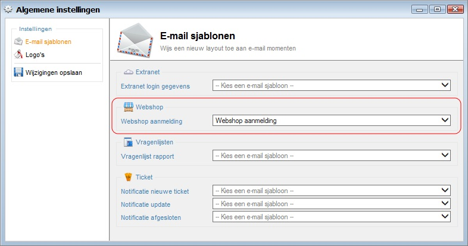
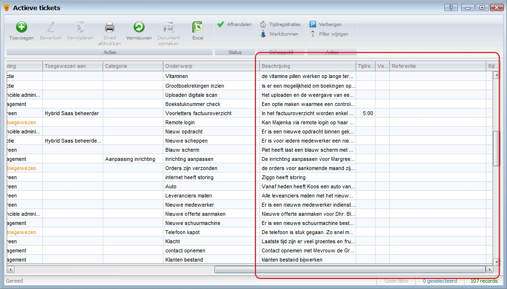
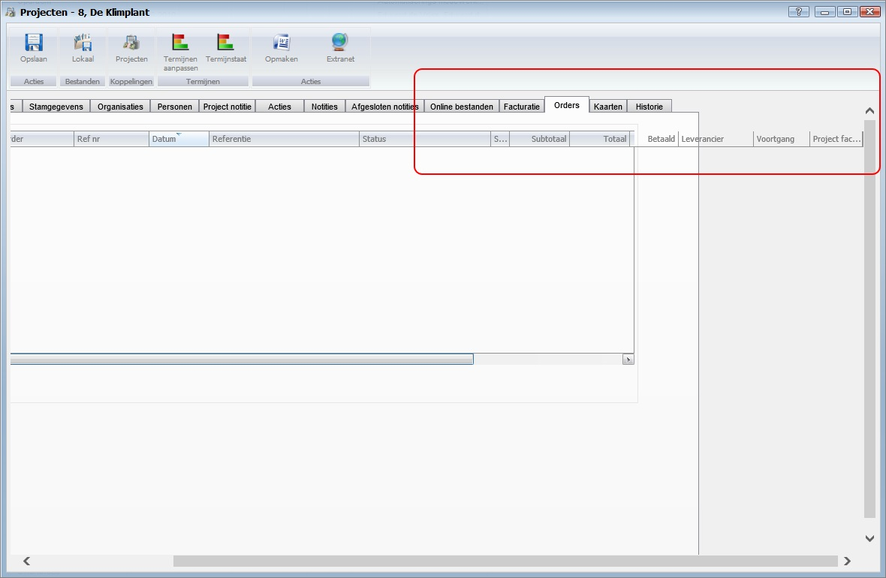

<properties menutitle="Release notes volgende versie" pagetitle="Release notes volgende versie" category="Release notes" />

Release notes volgende versie (nog niet uitgebracht)
===================
De volgende verbeteringen en aanpassingen zullen in de volgende versie van Hybrid SaaS beschikbaar komen

Aanmelding email bevestiging via nabestelwebsite
----------------------
Het is nu mogelijk om na aanmelding op de nabestelwebsite een maatwerk bevestiging te sturen naar de aanmelder.
Bij de *Algemene instellingen* onder het kopje *E-mail sjablonen* is een extra optie gekomen waar het *e-mail sjabloon* kan worden geselecteerd.

  
  
De organisatie gegevens kunnen worden gebruikt in de opmaak van dit e-mail sjabloon

 
Na het aanmelding op de nabestelwebsite ontvangt de aanmelder de vooraf ingestelde e-mail template 

	Indien er geen sjabloon is gekozen zal er uiteraard geen e-mail worden gestuurd na aanmelding.

Weergave van scrollbare dataweergave is verbeterd
------------------
De scrollbar van dataweergaven (*query's*) werkt niet helemaal juist, daardoor kon het voorkomen dat bijvoorbeeld niet naar de laatste kolom kon scrollen op lagere resoluties. Dit is opgelost.   

De scrollbalk loopt nu goed door naar rechts.

Weergave van sub-dataweergaven op invoerschermen is verbeterd
------------------
Ook op invoerschermen kon het voorkomen dat bepaalde sub-dataweergaven (*subquery's*) uitloop hadden in het invoerscherm.

Dit is verholpen en de schermen zien er daardoor weer goed uit.

Ticket geschiedenis
------------------
In de geschiedenis van een ticket kon het voorkomen dat de volgorde niet chronologisch was, de sortering is aangepast en de volgorde is nu weer aflopend.

Extranet ticket melding 'undefined'
------------------------
Indien er een ticket update email vanaf het extranet werd gestuurd met de FireFox browser, kwam er in de ticket geschiedenis de tekst 'undefined' te zien.

Maatwerk rapportage
------------------------
De maatwerkrapportage werd technisch 2x uitgevoerd. Dit is nu nog maar 1x. Een performance verbetering van 100%.   