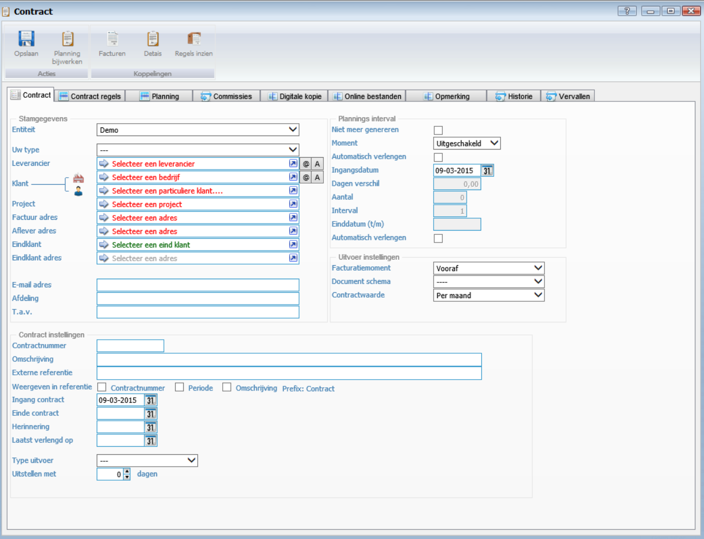

<properties>
	<page>
		<title>Contracten</title>
		<description> Hier wordt het proces voor het aanmaken van een nieuw contract beschreven. Ga naar Invoervenster contract voor meer informatie over het invoervenster van de contracten. Contracten worden gebruikt om terugkerende orders en of facturen autoamtisch te verwerken.  </description>
		<context>contract-*, dlgcontract</context>
</page>
	<menu>
		<position>START  /Contracten / Actieve contracten</position> 
		<title>Uitleg</title>
	</menu>
</properties>

# Contracten aanmaken #

**Aanmaken van een nieuw contract**

Er zijn 2 soorten contracten, de eerste genereert een factuur en de tweede een order. Hier wordt de factuur beschreven (voor een order gelden dezelfde stappen).

	INFO- het domein blijft gehost bij je provider.
	- de instellingen voor de domeinnaam worden aangepast, zodat bezoekers op die domeinnaam de website vinden die in Hybrid SaaS is gemaakt.
	- de instellingen voor mailaccounts bij het domein veranderen niet. Je kunt je mail dus zonder verandering blijven gebruiken.

WAARSCHUWING Let op:
Als je een domein via CNAME naar je Hybrid SaaS website wilt doorverwijzen, laat dat dan ook aan onze support weten. Het domein moet namelijk ook nog in ons systeem aan jouw Hybrid SaaS-omgeving worden gekoppeld.

TIP : Maak geen aparte *pull requests* aan voor elke zin die je hebt aanpast. Probeer een bepaald artikel (onderwerp) volledig te maken voor je deze ter controle aanbiedt. 

Eerste de contractgegevens voor de relatie.
 

- Entiteit
- Uw type
- Leverancier
- Klant
- Factuuradres
- Afleveradres
- Eindklant
- Eindklant adres
- E-mail adres
- Afdeling
- T.a.v.
- Contractnummer
- Omschrijving
- Externe referentie
- Weergeven in
- Ingangsdatum
- Herinnering
- Laatst verlengd op
- Type uitvoer
- Uitstellen met
- Niet meer genereren
- Moment
- Automatisch verlengen
- Ingangsdatum
- Dagen verschil
- Aantal
- Interval
- Einddatum 
- Automatisch verlengen
- Factuurmoment
- Document schema
- Contractwaarde
