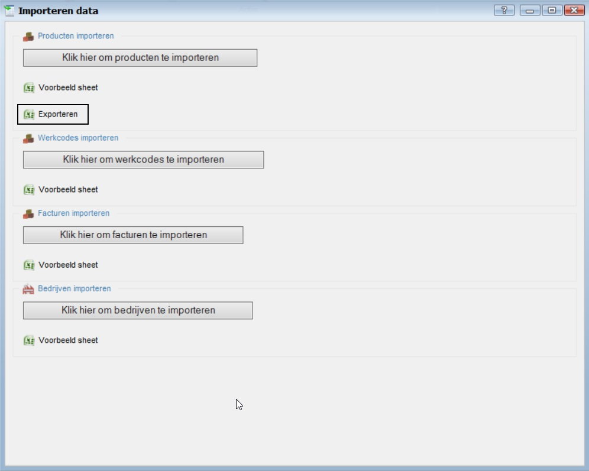
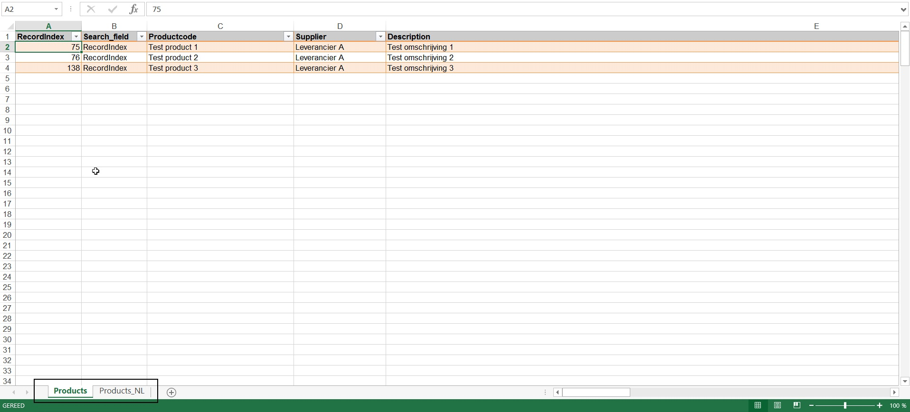
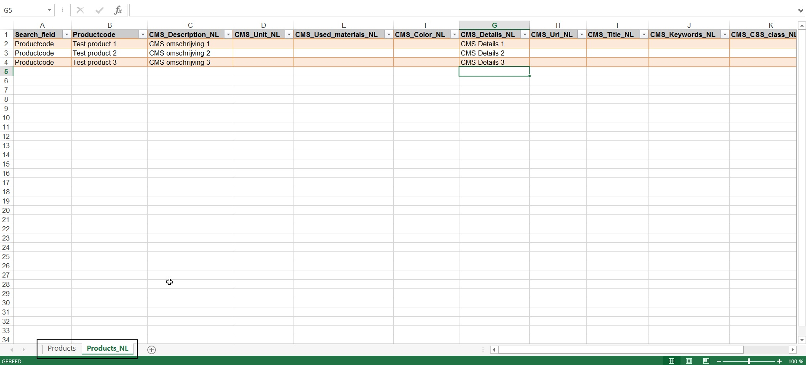
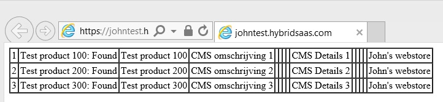
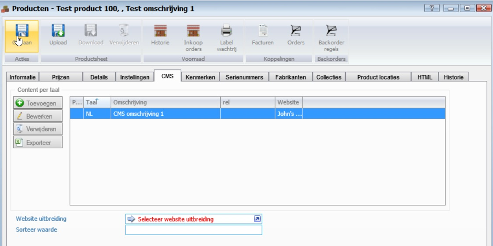

<properties>
	<page>
		<title>Producten imporeteren CMS</title>
	</page>
	<menu>
		<position>Handleiding / Producten / Importeren</position>
		<title>Importeren CMS</title>
	</menu>
</properties>

Importeren CMS
================================
Hier wordt uitgelegd hoe je eenvoudig de CMS gegevens va producten kan importeren.

**Exporteren producten**

Ga via de startknop naar "Importeren gegevens".
Exporteer door middel van de knop "exporteren" alle producten vanuit de database naar excel.
 

De geëxporteerde excelsheet bevat 2 tabbladen, namelijk "Products" en "Products NL".
Het tabblad Products is bedoeld om de gewone producten te importeren en het tabblad Product NL is er voor de CMS gegevens.

Als je nieuwe CMS records wilt toevoegen dan kan dit op basis van de kolom Search_field. Je voert hier het woord "Productcode" in en haalt de kolom "Search index" weg. 
Vul vervolgens alle kolommen in die nodig zijn.
Verwijder het tabblad "Products"en sla het bestand op.

**Importeren**

Ga via de startknop naar "Importeren gegevens".
Gebruik de knop "Klik hier om producten te importeren" om de producten te importeren. Zoek via de Windows verkenner het juiste importbestand op.
Na de import verschijnt er een window met daarin het resultaat van de import.

Je kan nu in HybridSaas bij de producten in het tabblad "CMS" de geïmporteerde gegevens terugvinden.

