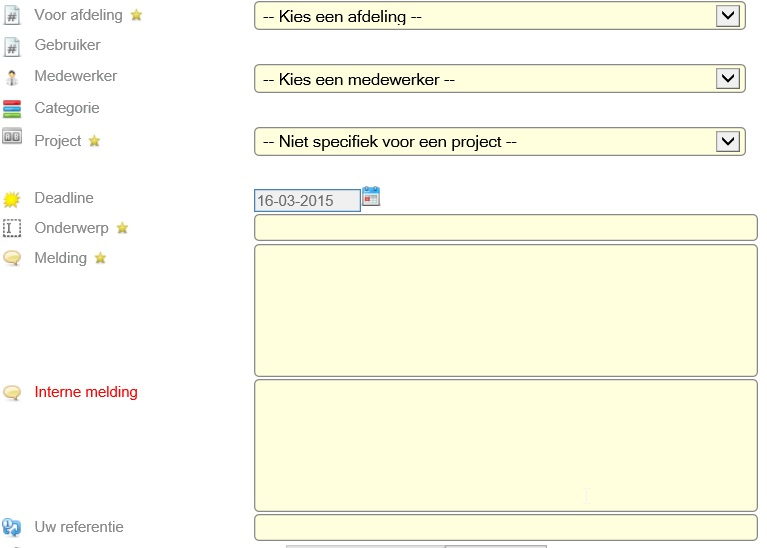
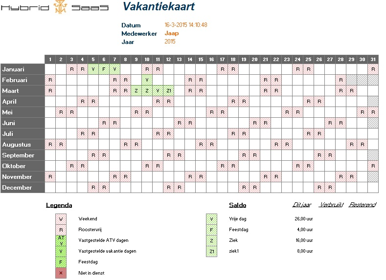

<properties>
	<page>
		<title>Release notes volgende versie</title>
	</page>
	<menu>
		<position>Release notes</position>
		<title>Volgende versie</title>
	</menu>
</properties>

Release notes volgende versie (nog niet uitgebracht)
===================
De volgende verbeteringen en aanpassingen zullen in de volgende versie van Hybrid SaaS beschikbaar komen

Ticket extranet - Interne opmerking kan nu worden toegevoegd bij het aanmaken van een ticket 
-----------------------------------------------------------------------------------------------------------

Bedrijfsagenda - Legenda wordt nu correct weergegeven
---------------------------------------------------------------------------------------------------------
Als je bij de de verloftype in het veld "legenda" een waarde ingeeft dan zal deze ook zichtbaar worden als je via de bedrijfsagenda het rooster exproteerd. Als het veld niet wordt gevuld, dan wordt er een nummer ingezet, en deze wordt niet in het rooster zichtbaar.  
  

Word Merge - Achter een variabel kan nu /maxlength=(int) gezet worden om tekst in te korten
-----------------------------------------------------------------------------------------------------------
plaatje + uitleg

Onderwerp - melding
-----------------------------------------------------------------------------------------------------------