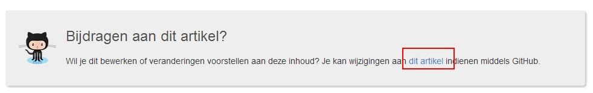
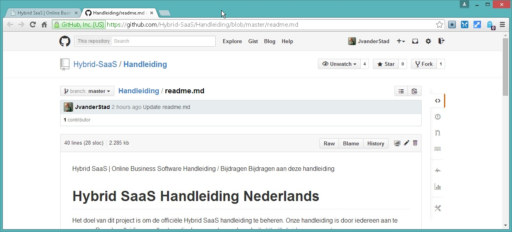
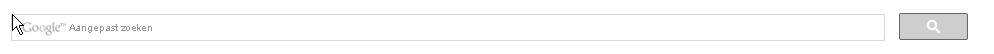

<properties>
	<page>
		<title>Hybrid SaaS | Online Business Software</title>
	</page>
	<menu>
		<position>Handleiding / Bijdragen</position>
		<title>Conventies</title>
	</menu>
</properties>

Conventies voor github
================================

**Definities**

Je kan definities linken uit de definities map, die link je met de tag <label>definitie</label> of <label keyword=” defintie”>lange omschrijving</label>
Ziet er dan na klik zo uit:

------------

**Extra hulp voor gebruiker**

Je kan ook extra informatie blokken ingeven

- het domein blijft gehost bij je provider.
- de instellingen voor de domeinnaam worden aangepast, zodat bezoekers op die domeinnaam de website vinden die in Hybrid SaaS is gemaakt.
- de instellingen voor mailaccounts bij het domein veranderen niet. Je kunt je mail dus zonder verandering blijven gebruiken.

---------------

**WARNING**

Let op:
Als je een domein via CNAME naar je Hybrid SaaS website wilt doorverwijzen, laat dat dan ook aan onze support weten. Het domein moet namelijk ook nog in ons systeem aan jouw Hybrid SaaS-omgeving worden gekoppeld.

--------------

**TIP**

Maak geen aparte *pull requests* aan voor elke zin die je hebt aanpast. Probeer een bepaald artikel (onderwerp) volledig te maken voor je deze ter controle aanbiedt. 

---------------

**Github integratie**

Onder aan elke pagina vind je de link naar de github locatie, zo kan je snel aanpassingen maken:

 

gaat naar:

 

Wijzigingen gepushed naar / gemaakt in GitHub worden direct verwerkt op de site, geef het een minuutje en het staat er.

-----

**Google zoeken**

Ik heb aangepast zoeken geintegreerd, deze moet nog wel worden geindexeerd, maar je kan dan direct zoeken naar content in de site.

 

-----